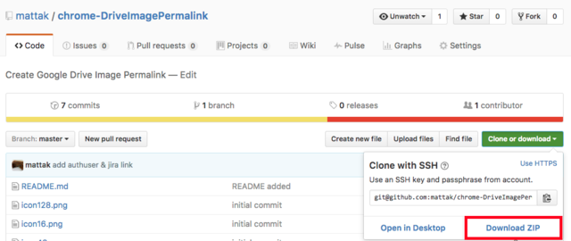
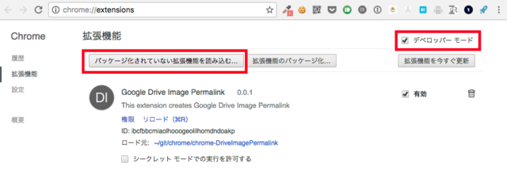
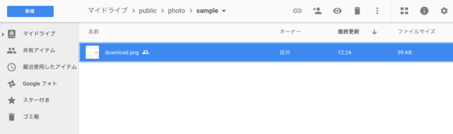
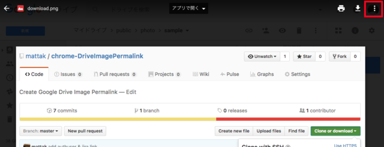
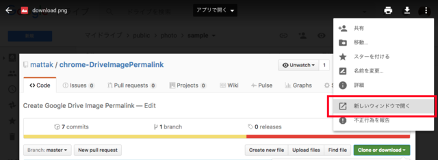
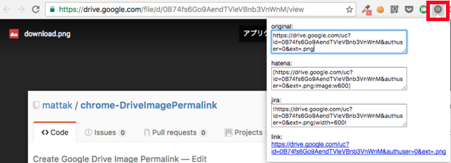

# chrome-DriveImagePermalink

This extension creates Google Drive Image Permalink from google drive image url.

## Install

### 1. download ZIP

### 2. unzip

unzip & place folder to any location you want.

### 3. install extension

check developer mode & install by specify the unzipped folder

## Usage

### 1. select image

### 2. open image & click detail option

### 3. open image as new window

### 4. select extension popup

## Special thanks

I'd appreciate contributors.

- @jjpixel (#1 markdown support)

